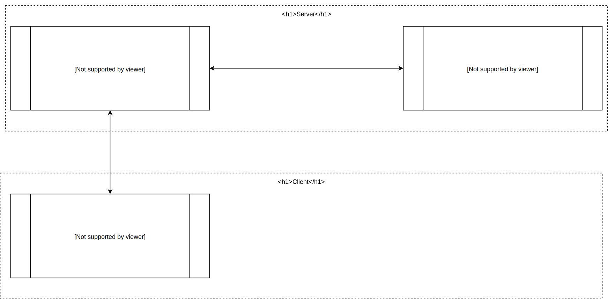

# IP network project
IP Network project for the third degree of computer science

# Design

## Tickets

| Category  | Price     | Student price (-20%)  | Number of tickets |
| :---:     | :---:     | :---:                 | :---:             |   
| 1         | 50 €      | 40 €                  | 50                |   
| 2         | 30 €      | 24 €                  | 150               |   
| 3         | 20 €      | 16 €                  | 100               |   

## Descriptions

## v1

### Sequence diagram

# Authors
- [Loïc Penaud](https://github.com/lpenaud)
- [Crenn Romain](https://github.com/CrennRomain)
